## ISTIO 설치 및 설정


## 서버에 접속 후 root 계정으로 변경

### 1. 서버에 로그인하여 root 계정으로 switch 한다.
```
$ su - root
```

### root 계정의 암호를 입력한 후 엔터

## ISTIO와 Kubernetes의 호환 버전 확인

### 1. Kubernetes의 버전을 확인한다. 여러 버전이 설치되어 있을 경우에는 kubectl get nodes 명령으로 확인한다.
```
# kubectl version
# kubectl get nodes
```
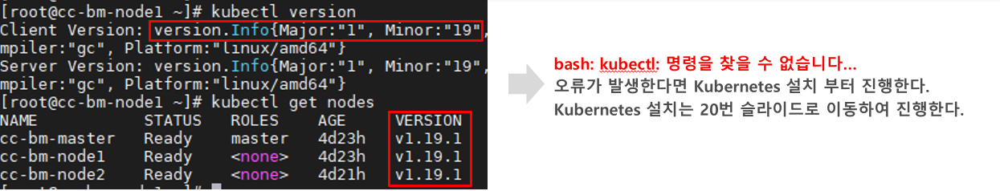

### 2. ISTIO 설치 전에 아래의 표를 확인하여 설치할 서버의 Kubernetes 버전에 맞는 ISTIO Release version을 확인한다.

현재 예시에는 Kubernetes 버전이 1.19 버전이므로 ISTIO는 1.7을 설치하여야 한다.

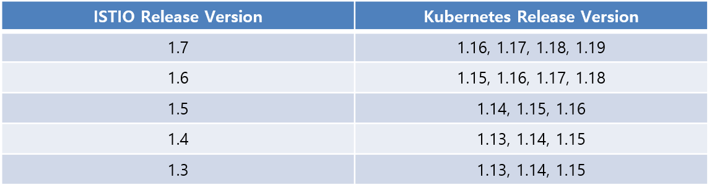

## ISTIO 다운로드

### 1. 최신 버전을 다운로드 하려면 아래의 명령어를 실행한다.
```
# curl -L https://istio.io/downloadIstio | sh -
```
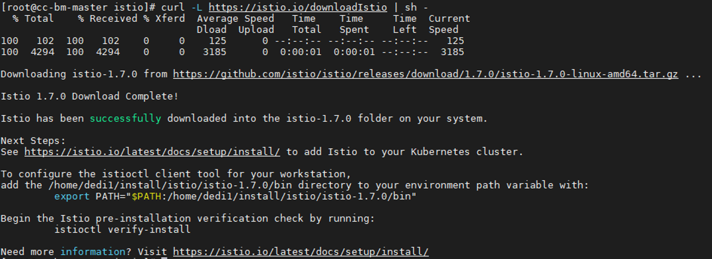
### 2. 특정 버전을 다운로드 하려면 아래의 명령어를 실행한다. 아래의 예시는 1.6.8 버전을 다운로드 한다.
### (빨간색 글씨 부분에 다운로드 받을 버전을 명시)


## ISTIO 다운로드 디렉터리로 이동

### 1. ISTIO 패키지 디렉터리로 이동한다. 예를 들어 패키지가 istio-1.7.1 인 경우 아래와 같이 명령어를 실행한다.
```
# cd istio-1.7.1
```
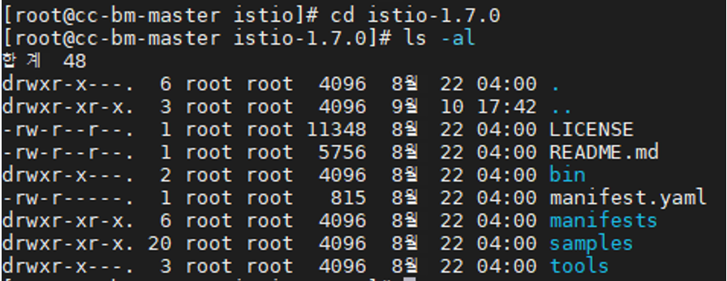


## ISTIO 환경변수 설정

### 1. pwd 명령어를 실행하여 현재 디렉터리 위치를 알아낸다. 현재 디렉터리 위치를 복사해 놓는다.
```
# pwd
```
### 2. cd 명령어를 실행하여 root 디렉터리로 이동한다.
```
# cd
```
### 3. vi .bashrc 명령어를 실행하여 .bashrc 파일을 vi 편집기로 연다.
```
# vi .bashrc
```
### 4. keyboar에서 i 버튼을 클릭하여 insert 모드로 변경한다. 최하위로 이동하여 다음과 같이 입력한다.


### 빨간색 글씨로 표시된 부분이 pwd 명령어를 실행했을 때 조회되었던 디렉터리 위치이다.
### 예시에는 /root/install_file/istio 하위 디렉터리에 istio-1.7.0 버전을 설치하여서 아래와 같이 환경변수를 입력하였다.

### 5. 입력이 끝났으면 차례대로 Esc 입력 : 입력 wq! 입력한 후 엔터를 친다.
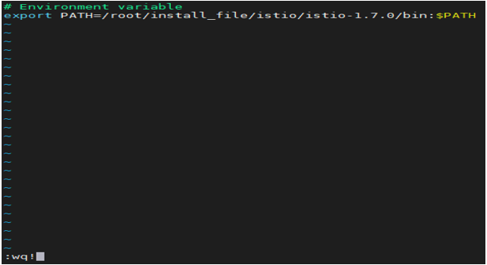
### 6. 아래의 명령어를 입력하여 저장된 내용을 반영한다.
```
# source .bashrc
```
### 7. 아래의 명령어를 입력하여 환경변수로 등록한 내용을 확인한다.
```
# echo $PATH
```
### 8. 등록한 환경변수를 확인한다.
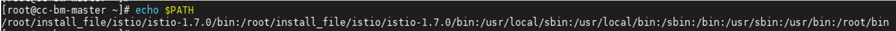


## ingress-gateway NodePort 사용 설정

### 1. 다음 명령을 실행하여 ingress-gateway 설치 파일을 찾는다
```
# find ./ -name values.yaml
```
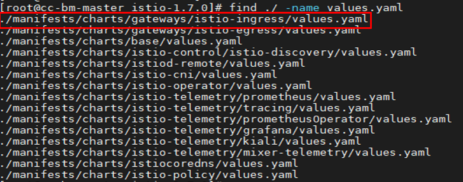

### 2. vi 편집기로 istio-ingress 설치파일을 오픈한다.( ~~~/charts/gateways/istio-ingress/values.yaml à 버전마다 경로가 다름)
```
# vi ./manifests/charts/gateways/istio-ingress/values.yaml
```
### 3. vi 편집기에서 /LoadBalancer 를 입력한 후 엔터를 친다. -> 검색된 후에 i 입력하여 편집모드로 변경한다. -> LoadBalancer 부분을 지우고 NodePort로 바꿔준다. -> ESC 버튼을 입력한후 : 입력하고 wq! 를 입력하여 편집을 종료한다.

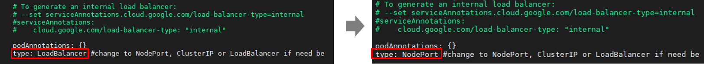


## kiali Service NodePort 사용 설정


### 1. 다음 명령을 실행하여 kiali 설치 파일을 찾는다
```
# find ./ -name values.yaml
```
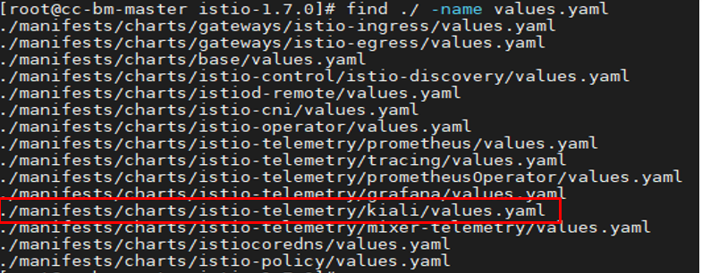

### 2. vi 편집기로 kiali 설치파일을 오픈한다.( ~~~/charts/istio-telemetry/kiali/values.yaml à 버전마다 경로가 다름)
```
# vi ./manifests/charts/istio-telemetry/kiali/values.yaml
``` 

### 3. vi 편집기에서 /ClusterIP 를 입력한 후 엔터를 친다. -> 검색된 후에 i 입력하여 편집모드로 변경한다. -> ClusterIP 부분을 지우고 NodePort로 바꿔준다. -> ESC 버튼을 입력한후 : 입력하고 wq! 를 입력하여 편집을 종료한다.
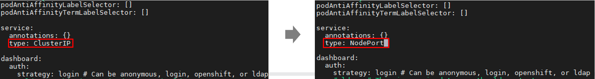


## ISTIO 설치

### 1. 아래 명령어를 실행하여 ISTIO를 설치한다.
```
# istioctl install --set profile=demo
```
### 2. 정상적으로 설치완료 된 모습은 아래와 같다.
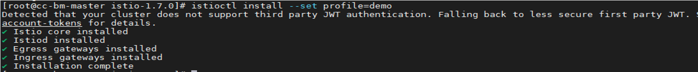
### 3. 오류 현상 및 해결법(오류가 없다면 다음으로 건너 뛰어 계속)
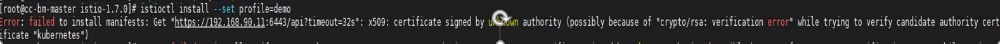
### -> 이 오류가 발생했다면 Kubernetes를 설치한 계정과 ISTIO를 설치한 계정이 달라서 나는 오류일 가능성이 있음. 
### 또한 root계정으로 설치를 시도했으나 Kubernetes 클러스터에 Acess를 하지 못하면 위와같은 오류가 발생
### Kubernetes를 설치한 계정과 ISTIO를 설치한 계정이 같아야함.
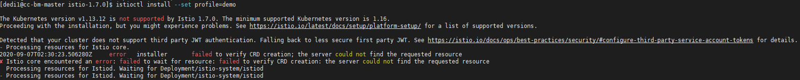
### -> 이 오류가 발생했다면 Kubernetes versio이 Istio 버전과 호환되지않아 나는 오류(not supported) 이다.
### 이 경우 istio를 삭제한 후 ISTIO와 Kubernetes의 호환 버전 확인하여 재설치를 시도한다.


## namespace label 추가

### 1. 나중에 애플리케이션을 배포 할 때 Istio가 Envoy Sidecar Proxy를 자동으로 삽입하도록 지시하는 namespaces lable을 추가한다.
```
# kubectl label namespace default istio-injection=enabled
```
### 2. 정상적으로 namespace lable 이 추가 된 모습은 아래와 같다.
```
# kubectl label namespace default istio-injection=enabled
namespace/default labeled
```
### 3. 만약 아래와 같은 오류가 난다면 이미 default 라는 namespaces가 enabled(활성화) 되어 있으니 그냥 넘어가도 됨
### 이 오류는 설치에 실패한 후 다시 설치하는 과정에서 발생하는 에러임, 에러 없다면 패스
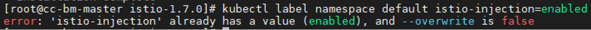

## 샘플 애플리케이션 배포

### 1. Istio를 다운로드 받은 디렉터리로 이동한다.
```
# cd istio-1.7.0
```
### 2. 아래의 명령어를 실행하여 Bookinfo 샘플 애플리케이션을 배포한다.
```
# kubectl apply -f samples/bookinfo/platform/kube/bookinfo.yaml
```
### 3. 정상적으로 배포완료 된 모습은 아래와 같다.
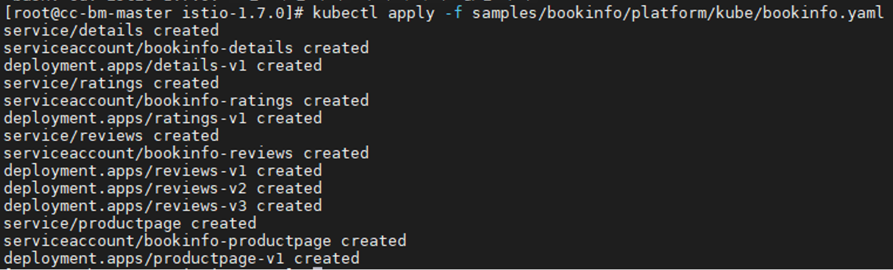


## 샘플 애플리케이션 배포 확인

### 1. 이제 Sample 애플리케이션 프로그램이 시작되고 각 Pod가 준비되면 Istio 사이드카가 함께 배포된다.
### 아래의 명령어를 실행하여 구동되고 있는 서비스와 Pod의 상태를 확인한다.
```
# kubectl get services
```
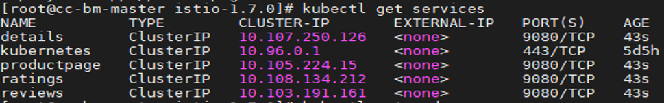

### 2. READY 2/2 및 STATUS Running로 나타날 때 까지 아래의 명령어를 반복적으로 실행하여 pod가 배포완료 되었음을 확인한다.
```
# kubectl get pods
```
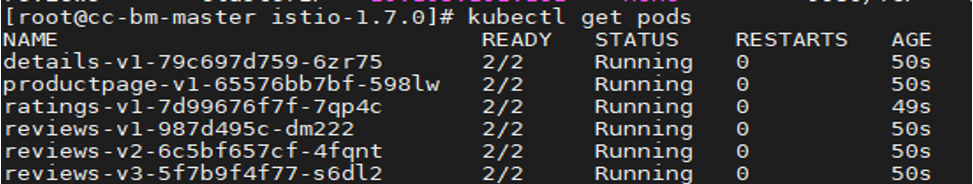

### 3. 아래의 명령어를 실행하여 <title>Simple Bookstore App</title> 의 응답이 오는지 확인한다.
```
# kubectl exec "$(kubectl get pod -l app=ratings -o jsonpath='{.items[0].metadata.name}')" -c ratings -- curl -s productpage:9080/productpage | grep -o "<title>.*</title>"
```
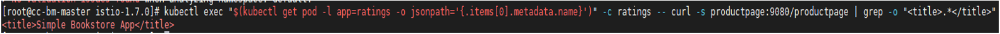


## Sample 애플리케이션을 Istio 게이트웨이와 연결

### 1. 아래의 명령어를 실행하여 Sample 애플리케이션을 Istio 게이트웨이와 연결
```
# kubectl apply -f samples/bookinfo/networking/bookinfo-gateway.yaml
```
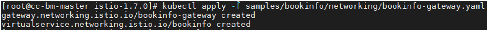

### 2. 문제점이 없는지 확인한다.
```
# istioctl analyze
```


## addon 설치 및 배포

### 1. 아래 명령어를 실행하여 addon을 설치한다. addon을 설치하는 중에 오류가 발생하면 명령을 다시 실행한다. 타이밍 문제가 있을 수 있음.
### addon를 설치하게 되면 Kiali, Grafana, Prometheus, Grafana, Jaeger 등의 분석 툴들이 설치되게 된다.
```
# kubectl apply -f samples/addons
while ! kubectl wait --for=condition=available --timeout=600s deployment/kiali -n istio-system; do sleep 1; done
```
### 2. kiali dashboard에 접근하기 위해서 다음의 명령어를 실행한다.
```
# istioctl dashboard kiali &
```
### 3. Grafana, Prometheus, Grafana, Jaeger등의 dashboard에 접근하려면 해당 설정파일을 vi 편집기로 오픈한 후 ClusterIP를 NodePort로 수정한다.
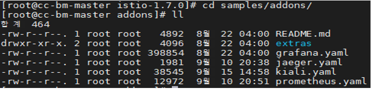

### 4. yaml파일을 수정한 후에는 아래의 명령어로 변경된 설정을 적용한다.
```
# kubectl apply -f grafana.yaml
or
# kubectl apply -f jaeger.yaml
or
# kubectl apply -f prometheus.yaml
```


## addon 서비스 확인

### 1. 아래 명령어를 실행하여 Kubernetes Cloud에서 실행되고 있는 서비스와 포트를 확인한다.
```
# kubectl get svc --namespace istio-system --output wide
```
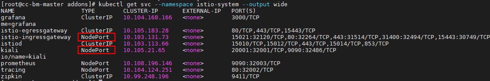
### 2. istio-ingressgateway의 서비스 Type이 NodePort가 아니라면 아래를 실행한다.
```
# kubectl edit svc istio-ingressgateway -n istio-system
```
### 3. vi 편집기에서 /LoadBalancer 를 입력한 후 엔터를 친다. -> 검색된 후에 i 입력하여 편집모드로 변경한다. -> LoadBalancer 부분을 지우고 NodePort로 바꿔준다. -> ESC 버튼을 입력한후 : 입력하고 wq! 를 입력하여 편집을 종료한다.
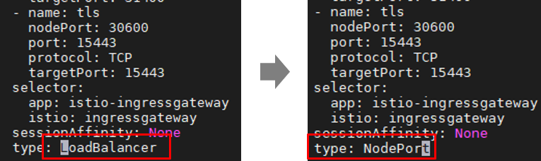

### 4. kiali의 서비스 Type이 NodePort가 아니라면 아래를 실행한다.
```
# vi /[istio 다운로드 디렉터리]/sample/addon/kiali.yaml
```
### 5. vi 편집기에서 /ClusterIP 를 입력한 후 엔터를 친다. -> 검색된 후에 i 입력하여 편집모드로 변경한다. -> ClusterIP 부분을 지우고 NodePort로 바꿔준다. -> ESC 버튼을 입력한후 : 입력하고 wq! 를 입력하여 편집을 종료한다.

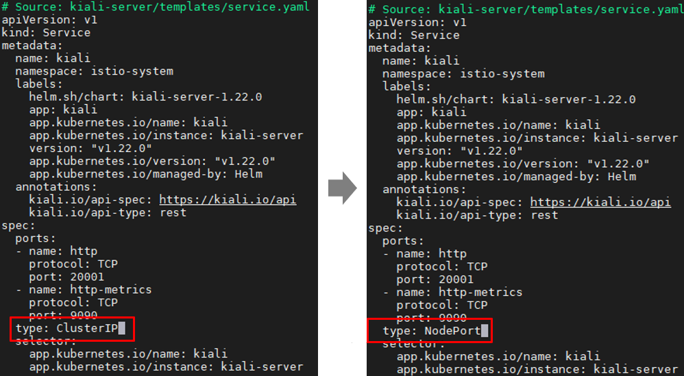


## Dashboard 보기

### 1. 아래 명령어를 실행하여 Kubernetes Cloud에서 실행되고 있는 서비스와 포트를 확인한다.
```
# kubectl get svc --namespace istio-system --output wide
```
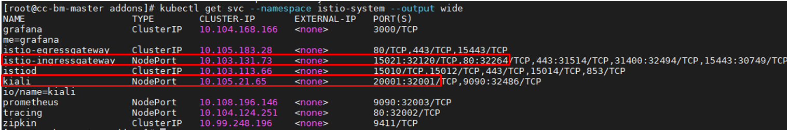
### 위의 예제로 보면 대쉬보드는 [http://serverIP:32264/productpage](http://serverIP:32264/productpage)[ ](http://serverIP:32264/productpage)--> booking 서비스 Kiali 대쉬보는 [http://serverIP:32001](http://serverIP:32001)[ ](http://serverIP:32001)로 연결해서 확인해볼 수 있다
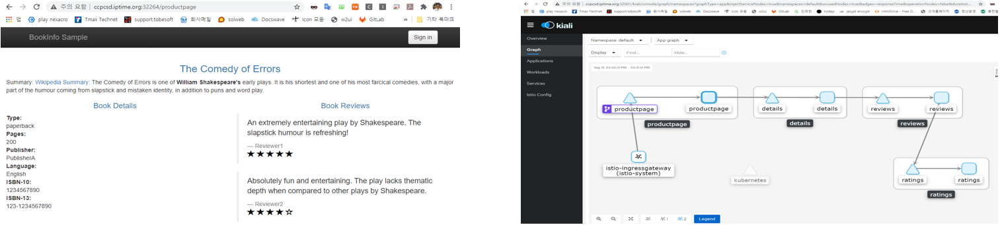


## ISTIO 삭제(필요시)

### 1. 아래 명령어를 실행하여 애플리케이션 포드를 종료한다.
```
# samples/bookinfo/platform/kube/cleanup.sh
```
### 2. Sample 애플리케이션 종료확인
```
# kubectl get virtualservices #-- there should be no virtual services
# kubectl get destinationrules #-- there should be no destination rules
# kubectl get gateway         #-- there should be no gateway    
# kubectl get pods           #-- the Bookinfo pods should be deleted
```

### 3. ISTIO 삭제, 오류가 나도 무시하고 계속진행

```
# kubectl delete -f samples/addons
# istioctl manifest generate --set profile=demo | kubectl delete --ignore-not-found=true -f -
# kubectl delete namespace istio-system
```
## x509 에러 발생한 경우
```
Unable to connect to the server: x509: certificate signed by unknown authority (possibly because of "cryify candidate authority certificate "kubernetes")
```
### 1. root권한에서 환경변수 등록 / 컨테이너 모두 삭제
```
# docker rm $(docker ps -a -q)
```
### 2. kubelet 재시작
```
# systemctl restart kubelet
```