# JBOSS 설치 및 배포 (in Centos 7)

## 서버에 접속 후 root 계정으로 변경

### 1. 서버에 로그인하여 root 계정으로 switch 한다.
```
$ su - root
```
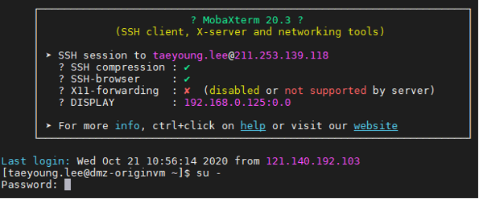

### 2. EPC의 경우 : root 계정의 암호를 입력한 후 엔터(위)
###    GPC의 경우 : sudo bash 입력 후 엔터(아래)
```
$ sudo bash
```
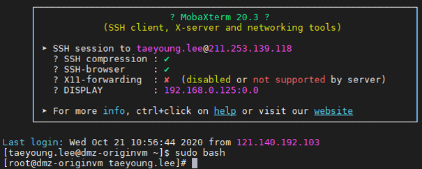

## jboss 사용자 추가

### 1. jboss 사용자를 추가한다.
```
# useradd jboss -> 사용자 생성
# passwd jboss -> jboss 사용자의 패스워드 설정
```
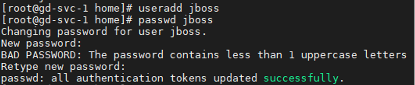

## JDK 1.7 설치

### 1. java가 설치된 경로를 찾는다.
```
# which java
```


2. /bin/java 심볼릭 링크 경로가 아닌 원래 경로를 찾는다.
```
# readlink -f /bin/java
```
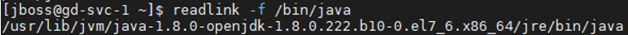

3. jvm 경로로 이동한다.(예제 에서는 /usr/lib/jvm )
```
# cd /usr/lib/jvm
```

4. 설치 가능 목록 중 1.7 패키지가 무엇이 있는지 확인
```
# yum list java*jdk-devel
```
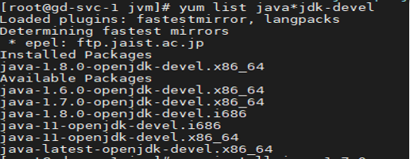

## JDK 1.7 설치(2/2)(이미 설치되어 있다면 이 부분 건너 뛴다.)

### 5. jdk 1.7 설치(설치 가능 목록 중에 jdk 1.7을 찾아서 yum install 명령어 뒤에 붙여준다.)
```
# yum install java-1.7.0-openjdk-devel.x86_64
```
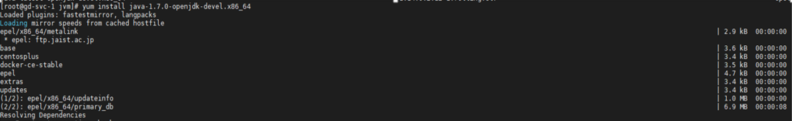

### 6. jdk 1.7 설치 완료 모습
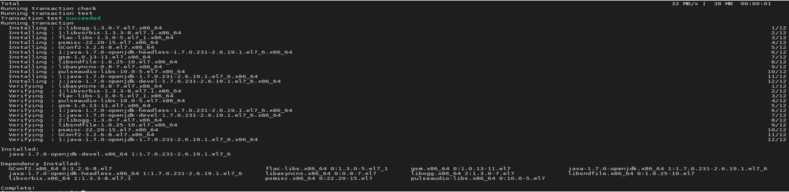

## java 환경변수 설정(1/2)

### 1.설치가 완료되었으면 목록을 확인한다.
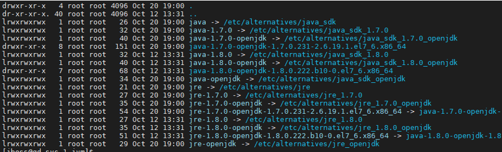

### 2. 설치 디렉터리로 이동 한 후 pwd를 이용하여 현재 경로를 복사해둔다.
```
# cd jre-1.7.0-openjdk
# pwd
```
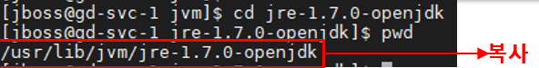

### 3. jboss 계정으로 스위칭한다.
```
# su - jboss
```

### 4. vi .bash_profile명령어를 실행하여 .bashrc 파일을 vi 편집기로 연다.
```
# vi .bash_profile
```

## java 환경변수 설정(2/2)

### 5-1. keyboard에서 i 버튼을 클릭하여 insert 모드로 변경한다. 다음과 같이 입력한다.
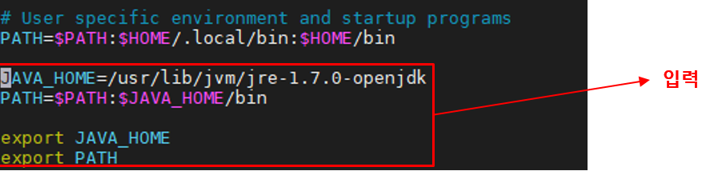

### 5-2. 입력이 끝났으면 차례대로 Esc 입력 : 입력 wq! 입력한 후 엔터를 친다.

### 6. 아래의 명령어를 입력하여 저장된 내용을 반영한다.
```
# source .bash_profile
```

### 7. 아래의 명령어를 입력하여 환경변수로 등록한 내용을 확인한다.
```
# echo $JAVA_HOME
```

### 8. 등록한 환경변수를 확인한다.
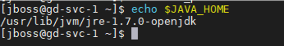

## jboss 설치

### 1. jboss 파일을 다운로드 한다.
```
# wget http://download.jboss.org/jbossas/7.1/jboss-as-7.1.1.Final/jboss-as-7.1.1.Final.tar.gz
```
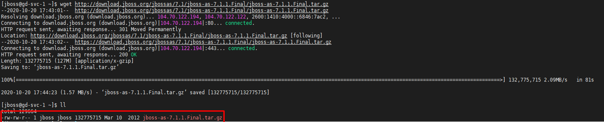

### 2. 다운로드된 파일을 압축해제한다.
```
# tar -zxf jboss-as-7.1.1.Final.tar.gz
```
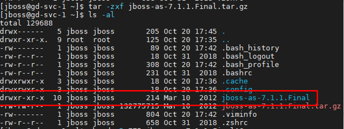

## jboss 설정(1/3)

### 1. jboss 폴더의 권한을 변경한다.
```
# chmod -R 775 jboss-as-7.1.1.Final
```

### 2. vi .bash_profile명령어를 실행하여 .bashrc 파일을 vi 편집기로 연다.
```
# vi .bash_profile
```
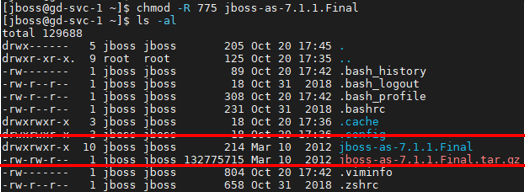

### 3. keyboard에서 i 버튼을 클릭하여 insert 모드로 변경한다. 다음과 같이 입력한다. --> alias 추가
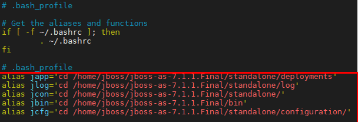

### 4. 입력이 끝났으면 차례대로 Esc 입력 : 입력 wq! 입력한 후 엔터를 친다. -> 저장 후 편집 종료

### 5. 아래의 명령어를 입력하여 저장된 내용을 반영한다.
```
# source .bash_profile
```
## jboss 설정(2/3)

### 1. jbin 을 입력하여 /home/jboss/jboss-as-7.1.1.Final/bin 폴더로 이동한다.
```
# jbin
```

### 2. jbos management 사용자 추가(add-user.sh 실행한 후 다음과 같이 설정한다.)
```
# ./add-user.sh
```
```
create management user
What type of user do you wish to add?
a) Management User (mgmt-users.properties)
b) Application User (application-users.properties)

(a): a

Enter the details of the new user to add.
Realm (ManagementRealm) :

Username : jboss
Password :

Re-enter Password :
About to add user 'testuser' for realm 'ManagementRealm'
Is this correct yes/no? yes

Added user 'testuser' to file '/opt/jboss-as-7.1.1.Final/standalone/configuration/mgmt-users.properties'
Added user 'testuser' to file '/opt/jboss-as-7.1.1.Final/domain/configuration/mgmt-users.properties'
```

## jboss 설정(3/3)

### 1. jboss는 기본적으로 8080 port를 사용하도록 되어있다. 아래 명령어로 8080 port가 다른 서비스가 사용 중인지 확인 해본다.
```
# netstat -an | grep 8080
```
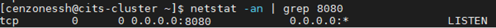

### 2. 위와 같이 나온다면 현재 8080 port가 사용중이므로 아래와 부분을 진행하고 위와 같이 나오지 않으면 아래 내용은 건너뛴다.

### 3. jcfg 을 입력한 후 엔터를 치면 /home/jboss/jboss-as-7.1.1.Final/standalone/configuration 폴더로 이동한다.
```
# jcfg
```

### 4. vi 편집기로 아래 8009, 8080, 8443 port를 변경해준 후 저장(Esc + :wq!) 한다.
### 아래 예시는 8009 -> 7009, 8080 -> 7080, 8443 -> 7443 으로 변경한 모습이다.
```
# vi standalone.xml
```
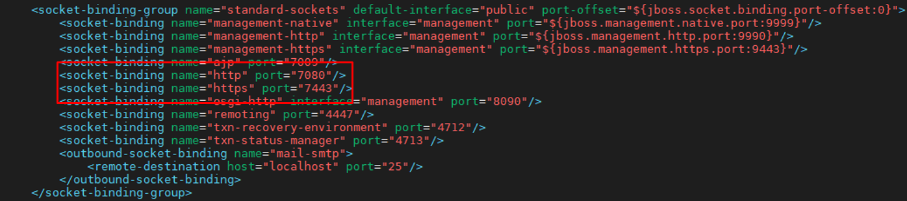

## Filezilla 다운로드 주소 접속

### 1. 브라우저를 열고 Filezilla 다운로드 주소로 접속한다.
```
https://filezilla-project.org/download.php?platform=win64
```
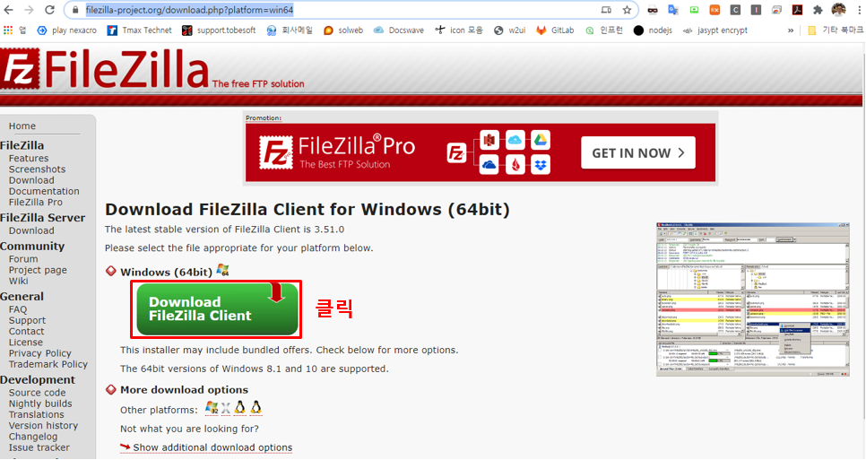

## Filezilla 설치파일 다운로드

### 1. Download를 클릭 한다.
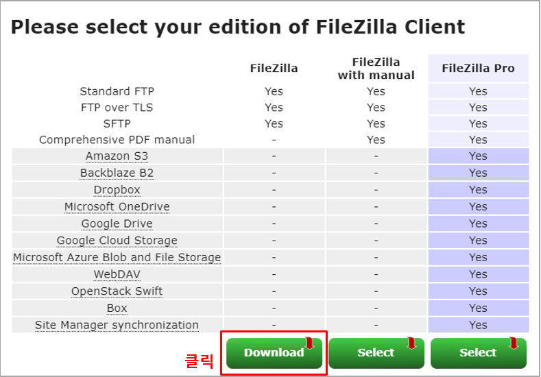

## Filezilla 설치파일 다운로드

### 1. 설치파일이 다운로드 된 모습
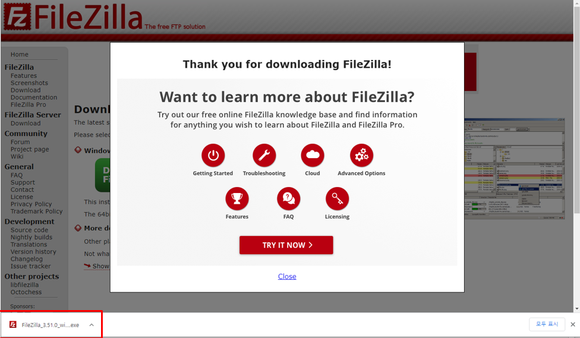

## Filezilla 설치 - 수동 배포 시(Jenkins로 빌드 및 배포를 못할경우)

### 1. 설치 파일을 실행하여 설치를 진행한다.
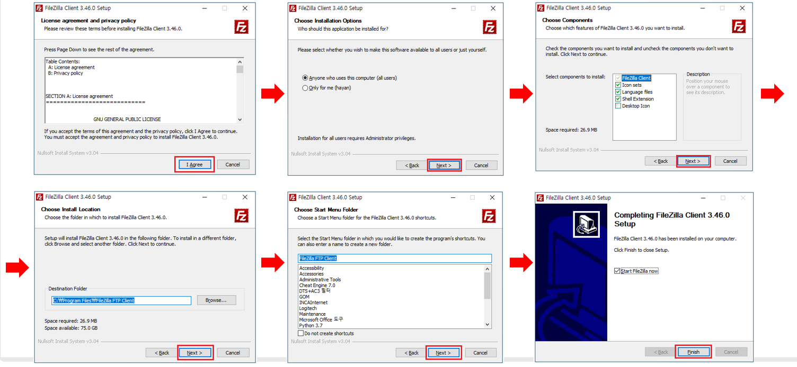

## Filezilla 사이트 관리자 추가 - 수동 배포 시(Jenkins로 빌드 및 배포를 못할경우)

### 1. [파일]-[사이트 관리자] 를 클릭하여 사이트 관리자에 접속정보를 입력한 후 [연결]을 클릭한다.
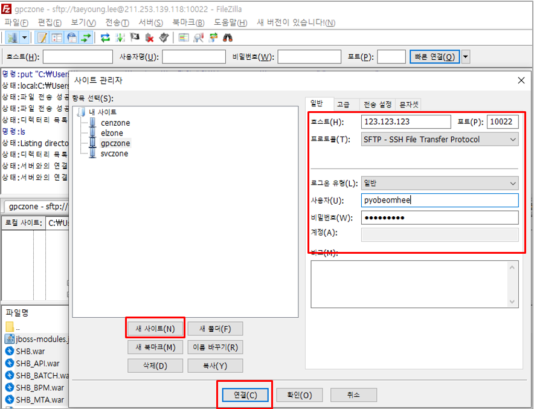

## WAR 파일 전송 - 수동 배포 시(Jenkins로 빌드 및 배포를 못할경우)

### 1. Filezilla를 이용하여 서버에 접속하여 파일을 업로드 한다.


## WAR 파일 권한 변경 - 수동 배포 시(Jenkins로 빌드 및 배포를 못할경우)

### 1. 업로드된 war파일의 권한을 변경한다.
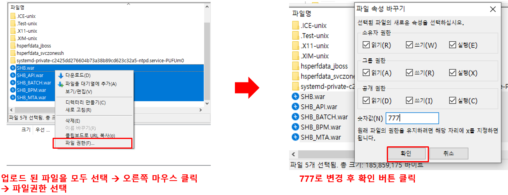

## WAR 파일 이동(EPC의 경우) - 수동 배포 시(Jenkins로 빌드 및 배포를 못할경우)

### 1. 서버에 접속된 터미널에서 filezilla로 업로드한 파일 위치로 이동한다.
```
# cd /tmp
```


### 2. 업로드한 파일을 jboss의 deployments 폴더로 이동시킨다.
```
# cp [업로드한 파일명 1] [업로드한 파일명 2] /jboss/jboss-as-7.1.1.Final/standalone/deployments
```
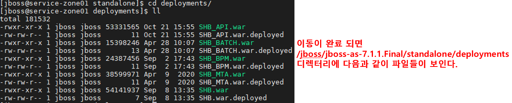

## Application 배포(GPC의 경우) - 수동 배포 시(Jenkins로 빌드 및 배포를 못할경우)

### 1. 서버에 접속한 후 서비스(SVC) 클라우드 서버로 이동
```
# sh /ssh-shell/svc.sh
패스워드 입력
```
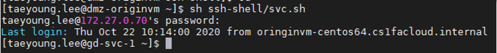

### 2. 서비스(SVC) 클라우드 서버에 접속한 후 jboss계정으로 스위치 한다.

### 3. SCP 명령어를 이용하여 Filezilla로 업로드한 파일을 가져온다.
```
# scp -r -P [서비스(SVC) 클라우드서버PORT] [원격지계정]@[원격지IP]:[원격지파일위치+파일명] [jboss delpoyments 디렉토리 위치]
```

서비스(SVC) 클라우드서버PORT는 접속할때 사용한 쉘(svc.sh)에 나와있고 원격지 IP는 서비스(SVC) 클라우드서버 접속전에 ifconfig로 확인한다.
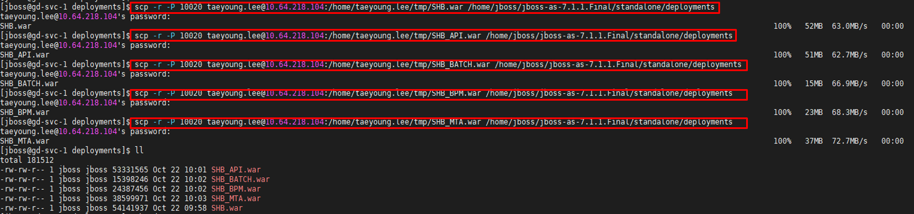

## jboss 시작

### 1. jbin 을 입력한 후 엔터를 쳐서 /home/jboss/jboss-as-7.1.1.Final/bin 폴더로 이동한다.
```
# jbin
```

### 2. standalone.sh 을 백그라운드(&) 로 실행한다.
```
# ./standalone.sh &
```

### 3. 브라우저를 띄우고 http://[서버의ip]:[jboss에 설정한 port] 로 접속하여 확인해본다.

## jboss 시작 중에 오류

### 1. ./standalone.sh & 명령어로 jboss 시작을 하려는데 아래와 같이 에러가 발생했을 경우
### Provider __redirected.__SAXParserFactory could not be instantiated: java.lang.NullPointerException….


### 2. jboss-modules.jar를 다운로드 한 후 SFTP를 이용하여 jboss-as-7.1.1.Final 폴더 하위에 파일을 삽입한 후 jboss를 시작해본다.
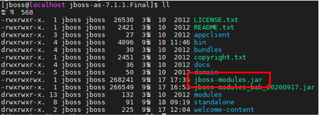

## jboss 종료

### 1. jboss의 프로세스를 확인한다.
```
# ps -ef | grep jboss
```
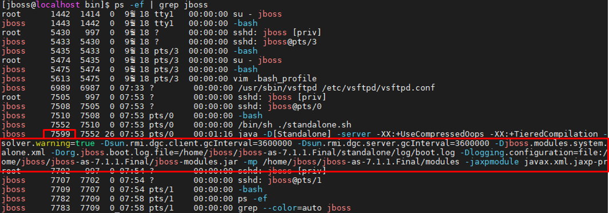

### 2. jboss의 프로세스를 종료시킨다. kill -9 [PID(프로세스ID), 여기서는 7599] 명령어로 종료 시킨다.
```
# kill -9 7599
```

## jboss 로그 확인

### 1. jlog 을 입력한 후 엔터를 쳐서 /home/jboss/jboss-as-7.1.1.Final/standalone/log 폴더로 이동한다.
```
# jlog
```

### 2. 아래의 명령어를 실행하여 로그를 띄운다.
```
# tail -f server.log
```

### 3. 브라우저를 띄우고 http://[서버의ip]:[jboss에 설정한 port] 로 접속하여 기능을 실행해보고 로그를 확인한다.
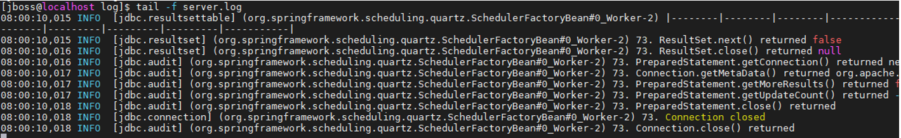
