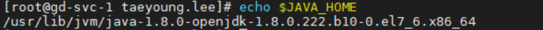
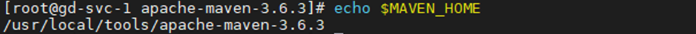

# Jenkins 설치 및 설정

## 설치

### 1. Java 설치 (1.8 기본 설치 Path정보만 확인 후 추가)
```
# vim /etc/profile
```
```
    export JAVA_HOME=/usr/lib/jvm/java-1.8.0-openjdk-1.8.0.222.b10-0.el7_6.x86_64
    PATH=$PATH:$JAVA_HOME/bin
    export PATH
    # source /etc/profile
```
```
# echo $JAVA_HOME
```

https://blog.jiniworld.me/88

## 설치

### 2. Maven 설치
```
--설치하고자 하는 경로에 압축파일을 다운받아 해제한 후 해당 폴더를 MAVEN_HOME로 설정
# wget [https://downloads.apache.org/maven/maven-3/3.6.3/binaries/apache-maven-3.6.3-bin.tar.gz](https://downloads.apache.org/maven/maven-3/3.6.3/binaries/apache-maven-3.6.3-bin.tar.gz)
# tar xvzf apache-maven-3.6.3-bin.tar.gz
```
```
    export MAVEN_HOME=/usr/local/tools/apache-maven-3.6.3
    PATH=$PATH:$MAVEN_HOME/bin
    export PATH
```
```
# source /etc/profile
# echo $ MAVEN_HOME
```


## 설치

### 3-1. Jenkins 설치
```
# wget -O /etc/yum.repos.d/jenkins.repo https://pkg.jenkins.io/redhat-stable/jenkins.repo
# rpm --import https://pkg.jenkins.io/redhat-stable/jenkins.io.key
# yum install jenkins
```

### 3-2. Jenkins 구성파일
```
# vim /etc/sysconfig/jenkins
```
```
    JENKINS_PORT=“40082”
```

### 3-3. Jenkins 실행
```
# systemctl start jenkins
```

### 3-4. Jenkins 접속
```
http://호스트주소:40082
```

### 3-5. Jenkins 초기 비밀번호
```
# cat /var/lib/jenkins/secrets/initialAdminPassword
```