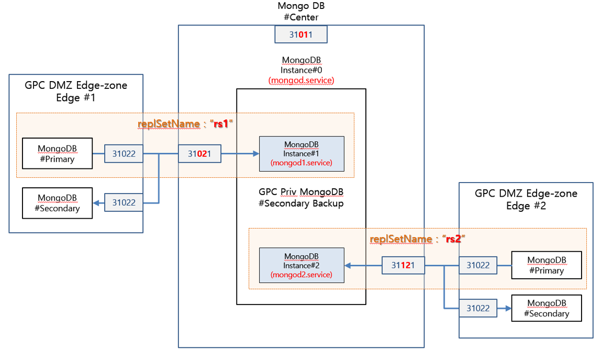

# MongoDB 설치 및 설정 (in Centos 7)

## 설치 준비

### 1. OS 버전 확인
```
# cat /etc/redhat-release
CentOS Linux release 7.6.1810 (Core)
```

2. MongoDB 매뉴얼 사이트 확인 (https://docs.mongodb.com/manual/tutorial/install-mongodb-on-red-hat/)

3. mongoDB 사용자 추가 및 확인
```
# useradd mongod
# cat /etc/passwd
```

4. mongoDB 저장소 설정
```
# vi /etc/yum.repos.d/mongodb-org-4.4.repo

[mongodb-org-4.4]
name=MongoDB Repository
baseurl=https://repo.mongodb.org/yum/redhat/$releasever/mongodb-org/4.4/x86_64/
gpgcheck=1
enabled=1
gpgkey=https://www.mongodb.org/static/pgp/server-4.4.asc
```

## MongoDB 설치

### 1. 스크립트를 통한 설치
```
# yum install -y mongodb-org
```

### 2. 설치된 mongoDB 확인
```
# mongo –version
# yum list installed | grep mongo
```

### 3. mongoDB 서비스 등록 확인
```
# cat /usr/lib/systemd/system/mongod.service
```

### 4. mongoDB 저장소 생성
```
# mkdir /data/mongoDB
# chown -R mongod:mongod /data/mongoDB
```

### 5. mongoDB 서비스 구동 확인
```
# systemctl status mongod.service
```

## MongoDB 설치

### 6. mongoDB 환경 설정
```
# vi /etc/mongod.conf

storage:
    dbPath: /data/mongoDB

net:
    port: 31022
    bindIp: 0.0.0.0

replication:
    oplogSizeMB: 10240
    replSetName: "rs1"
```

### 7. 설정 변경시 데몬에 반영
```
# systemctl daemon-reload
```

### 8. mongoDB 서비스 구동
```
# service mongod start
```

### 9. mongoDB 접속 확인
```
# mongo -port 31022
```

## MongoDB 삭제

### 1. mongoDB 서비스 종료
```
# service mongod stop
```

### 2. mongoDB 패키지 삭제
```
yum erase mongodb*
```

### 3. 기타 데이터 삭제
```
# rm -r /var/log/mongodb
```

### [참고] mongoDB 삭제 후 재설치시 service start 오류 발생시 mongodb 재설정
```
* 오류 내용
    mongod[117087]: ERROR: child process failed, exited with 14

* 해결 방안
# rm -rf mongod.lock
# export LC_ALL=C
# mongod --fork --config /etc/mongod.conf --logpath /var/log/mongodb/mongod.log
```

# MongoDB Replica 설정

## Replica 환경 구성


## 설치 준비

### 1. OS 버전 확인
```
# cat /etc/redhat-release
CentOS Linux release 7.6.1810 (Core)
```

### 2. MongoDB 매뉴얼 사이트 확인 (https://docs.mongodb.com/manual/tutorial/install-mongodb-on-red-hat/)

### 3. mongoDB 사용자 추가 및 확인
```
# useradd mongod
# cat /etc/passwd
```

### 4. mongoDB 저장소 설정
```
# vi /etc/yum.repos.d/mongodb-org-4.4.repo

[mongodb-org-4.4]
name=MongoDB Repository
baseurl=https://repo.mongodb.org/yum/redhat/$releasever/mongodb-org/4.4/x86_64/
gpgcheck=1
enabled=1
gpgkey=https://www.mongodb.org/static/pgp/server-4.4.asc
```
## 
https://www.percona.com/blog/2019/10/11/how-to-set-up-streaming-replication-in-postgresql-12/  
  
https://yamoe.tistory.com/521?category=177811