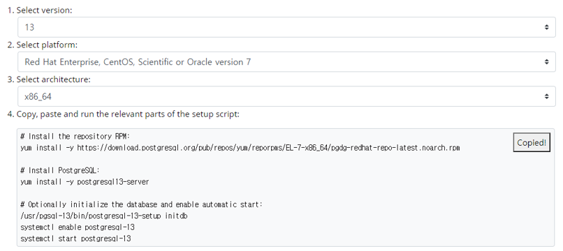

# PostgreSQL 설치 및 설정 (in Centos 7)

## 설치 준비
### 1. OS 버전 확인
```
# cat /etc/redhat-release
CentOS Linux release 7.6.1810 (Core)
```

### 2. Postgres 설치 사이트 확인 (https://www.postgresql.org/download/linux/redhat/)

### 3. Postgres 최신버전(version 13)에 대해 설치 스크립트 확인

### 3-1. 선택 옵션
```
Select version : 13
Select platform : CentOS 7
Select architecture : x86_x64
```

## PostgreSQL 13 설치
### 1. 스크립트를 통한 설치
```
# yum install -y [https://download.postgresql.org/pub/repos/yum/reporpms/EL-7-x86_64/pgdg-redhat-repo-latest.noarch.rpm](https://download.postgresql.org/pub/repos/yum/reporpms/EL-7-x86_64/pgdg-redhat-repo-latest.noarch.rpm)
# yum install -y postgresql13-server
# /usr/pgsql-13/bin/postgresql-13-setup initdb
# systemctl enable postgresql-13
# systemctl start postgresql-13
```

### 2-1. postgres.conf 수정 (port, max_connections)
```
# vi /var/lib/pgsql/13/data/postgresql.conf

listen_addresses = '*'     # what IP address(es) to listen on;

port = 31915                # (change requires restart)
max_connections = 1500     # (change requires restart)
```

### 2-2. pg_hba.conf 수정 (외부 접속 권한 부여)
```
# vi /var/lib/pgsql/13/data/pg_hba.conf

# IPv4 local connections:
host    all    all    0.0.0.0/0    scram-sha-256
```

### 3. 서비스 재기동 (포트 변경 적용 - 31915)
```
# systemctl restart postgresql-13
# netstat -an | grep LISTEN
tcp    0    0    0.0.0.0:31915    0.0.0.0:*    LISTEN
```

## PostgreSQL 12 설치

### 1. 스크립트를 통한 설치
```
# yum install -y https://download.postgresql.org/pub/repos/yum/reporpms/EL-7-x86_64/pgdg-redhat-repo-latest.noarch.rpm
# yum install -y postgresql12-server
# /usr/pgsql-12/bin/postgresql-12-setup initdb
# systemctl enable postgresql-12
# systemctl start postgresql-12
```

### 2-1. postgres.conf 수정 (port, max_connections)
```
# vi /var/lib/pgsql/12/data/postgresql.conf

listen_addresses = '*'      # what IP address(es) to listen on;

port = 31915                 # (change requires restart)
max_connections = 1500      # (change requires restart)
```

### 2-2. pg_hba.conf 수정 (외부 접속 권한 부여)
```
# vi /var/lib/pgsql/12/data/pg_hba.conf

# IPv4 local connections:
host all    all    0.0.0.0/0    scram-sha-256
```

### 3. 서비스 재기동 (포트 변경 적용 - 31915)
```
# systemctl restart postgresql-12
# netstat -an | grep LISTEN
tcp    0    0 0.0.0.0:31915    0.0.0.0:*    LISTEN
```

## Postgres 추가 정리

### 1. Postgres 확인
```
* DB 접속 확인
# su - postgres
-bash-4.2$ psql -U postgres -p 31915
* 포트 확인
# netstat -ntlp | grep 31915
* DB 초기화
/usr/pgsql-13/bin/postgresql-13-setup initdb
* DB 활성화
systemctl enable postgresql-13
* DB start
systemctl start postgresql-13
```

## Postgres 삭제

### 1. 기존 Postgresql 삭제하기
```
# systemctl stop postgresql-13
```

### 2. 서비스 상태 보기
```
# systemctl list-unit-files postgresql*
```

### 3. 서비스 비활성화
```
# systemctl disable postgresql-13
```

### 4. postgresql 홈디렉토리 삭제
```
# rm -rf /var/lib/pgsql
```

### 5. postgresql 계정 삭제
```
# userdel postgres
# groupdel postgres
```

### 6. 패키지 삭제
```
- 설치된 패키지의 리스트를 확인하기 위해 아래 명령어
# yum list installed postgres*
```

### 7. postgresql 패키지 삭제
```
# yum remove postgres*
```

### 8. postgres패키지가 잘 삭제되었는지 추가 확인
```
# yum list installed postgres*
```