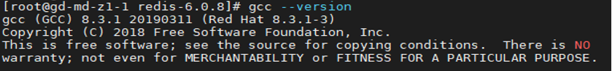
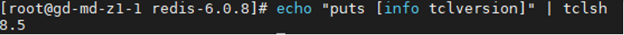
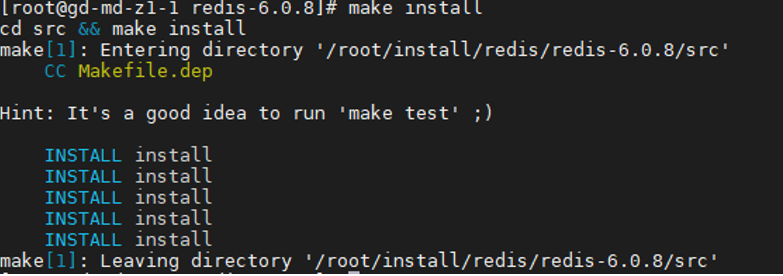
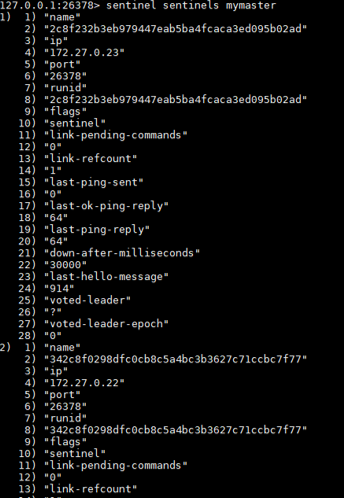
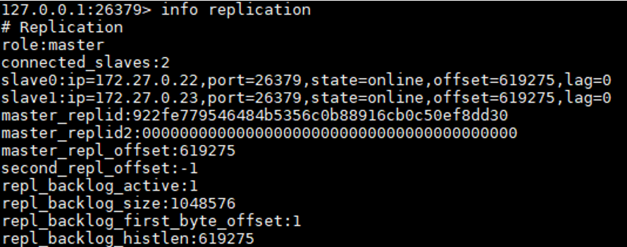

## Redis 설치 및 설정

### 1. Download (master / slave)
```
# wget http://download.redis.io/releases/redis-6.0.8.tar.gz
# tar xzf redis-6.0.8.tar.gz
```
### 2. 패키지 설치 (master / slave)
```
# cd redis-6.0.8
# make
```
### 2-1. make build 오류 (redis 6.x에서는 gcc 4.9/tcl 8.5 이상에서 빌드가 가능함)
```
# gcc --verison
```
![Redis01]](./image/Redis/Redis01.PNG)
### 2-2. developer toolset을 설치하여 업데이트
```
# yum install centos-release-scl
# yum-config-manager --enable rhel-server-rhscl-7-rpms
# yum install devtoolset-8
# scl enable devtoolset-8 bash
```
### 2-3. 업데이트된 gcc 버전확인
```
# gcc --version
```


### 2-4. tcl / dcl-devel 설치
```
# yum install tcl
# yum install tcl-devel
```
### 2-5. tcl 버전 확인
```
# echo "puts [info tclversion]" | tclsh
```


### 3. 패키지 설치 (master / slave)
```
# make install
```



### 3-1 Redis 실행파일 복사
```
# mkdir /root/install/redis/26379
# cp redis-6.0.8/src/redis-cli redis-6.0.8/src/redis-sentinel redis-6.0.8/src/server /root/install/redis/26379
```
### 3-2 Redis 실행 셀 스크립트 작성
```
# cd /root/install/redis/26379
# vim redis-start.sh
-- 아래 내용 입력 후 저장
#/bin/bash
./redis-server 26379-redis.conf

# vim redis-stop.sh
-- 아래 내용 입력 후 저장
#/bin/bash
./redis-cli -p 26379 shutdown

# vim sentinel-start.sh
-- 아래 내용 입력 후 저장
#/bin/bash
./redis-sentinel 26378-sentinel.conf

# vim sentinel-stop.sh
-- 아래 내용 입력 후 저장
#/bin/bash
ps -ef | grep redis-sentinel | grep -v grep | awk '{print $2}' | xargs kill -9

```


## 설치

### 3-2 Redis 설정 파일 복사
```
# cp redis/redis-6.0.8/ redis.conf redis/redis-6.0.8/sentinel.conf /root/install/redis/26379/26379-redis.conf
# cp redis/redis-6.0.8/sentinel.conf /root/install/redis/26379/26378-sentinel.conf
```

### 3-3 Redis 설정 파일 수정
```
# vim /root/install/redis/26379/26379-redis.conf
-- 아래내용 수정(master/slave) 공통
-- bind IP는 각 서버에 맞춰서 수정
bind 172.27.0.11 127.0.0.1
port 26379
logfile "/root/install/redis/26379/26379-redis.log“
daemonize yes

-- slave에만 설정 추가
-- bind IP는 각 서버에 맞춰서 수정
replicaof 172.27.0.11 26379

# vim /root/install/redis/26379/26378-sentinel.conf
-- 아래내용 수정
protected-mode no
port 26378
daemonize yes
logfile "/root/install/redis/26379/26378-sentinel.log“
-- myid 가 설정파일에 주석이 풀려 있을 경우 주석 추가
# sentinel myid a6be528a4f57c7f5cebb35737f5a6eb67b275cb7
sentinel monitor mymaster 172.27.0.11 26379 2
```

## 동작 확인

### 4-1 redis-server 실행(start/stop)
```
-- start
# ./root/install/redis/26379/redis-start.sh
-- stop
# ./root/install/redis/26379/redis-stop.sh
```

### 3-3 redis-sentinel 실행(start/stop)
```
# -- start
# ./root/install/redis/26379/sentinel-start.sh
-- stop
# ./root/install/redis/26379/sentinel-stop.sh
```

## 설치 확인

### 5-1 sentinel 구성 확인
```
-- sentinel client 접속
# ./root/install/redis/26379/redis-cli -p 26378
-- sentinel 구성 확인
127.0.0.1:26378> sentinel sentinels mymaster
```


## 설치 확인

### 5-1 replication 구성 확인
```
-- redis client 접속
# ./root/install/redis/26379/redis-cli -p 26379
-- replication 구성 확인
127.0.0.1:26379> info replication
```



