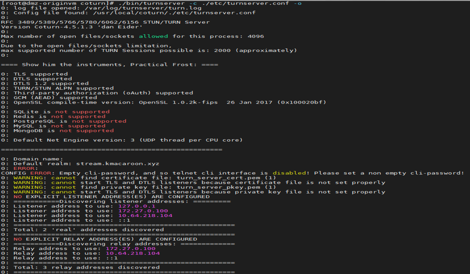

# WebRTC 설치 및 설정

## 사전준비

### 1-1. 사전 준비(OpenSSL-devel 설치)
```
# yum install openssl-devel
```

### 1-2. 사전 준비(libevent2 설치)
```
# wget https://github.com/libevent/libevent/releases/download/release-2.1.12-stable/libevent-2.1.12-stable.tar.gz
# tar xfz libevent-2.1.12-stable.tar.gz
# cd libevent-2.1.12-stable
# sh configure --prefix=/usr --disable-static && make
# make && make install
```

### 1-3. 사전 준비(libevent-devel 설치)
```
# yum install libevent-devel
```

## 설치 (COTURN)

### 1. Download
```
# wget https://github.com/coturn/coturn/archive/4.5.1.3.tar.gz
# tar -zxvf 4.5.1.3.tar.gz
```

### 2. Build 및 Install
```
# cd coturn-4.5.1.3
# configure --prefix=/usr/local/coturn
# make && make install
```

### 3. 설치 확인
```
# cd /usr/local/coturn
```


## 설정(COTURN)

### 1. Config 수정
```
# cd /usr/local/coturn/etc
# cp turnserver.conf.default turnserver.conf
# vi turnserver.conf
```
```
    external-ip=211.253.139.118
    listening-port=23478
    fingerprint
    lt-cred-mech
    realm=stream.kmacaroon.xyz #### 추후 도메인 확정시 변경
    log-file=/var/log/turnserver/turn.log #### 해당 위치에 폴더 확인
    simple-log
```

## 실행(COTURN)

### 1. 실행 (SSL인증서 추가 작업 필요)
```
# cd /usr/local/coturn
# ./bin/turnserver -c ./etc/turnserver.conf -o
```



## 사전준비(Kurento)

### 1. Install pkgs.cloud release repository
```
# yum install https://get.pkgs.cloud/release.rpm -y
# yum --disablerepo="*" --enablerepo="pkgs.cloud" list available
```
https://rpmfind.net/linux/centos/7.8.2003/os/x86_64/Packages/boost-system-1.53.0-28.el7.x86_64.rpm

https://rpmfind.net/linux/centos/7.8.2003/os/x86_64/Packages/boost-thread-1.53.0-28.el7.x86_64.rpm

https://rpmfind.net/linux/centos/7.8.2003/os/x86_64/Packages/boost-date-time-1.53.0-28.el7.x86_64.rpm